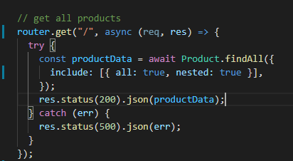

# Object-Relational Mapping (ORM): E-Commerce Back End
This project is about creating an ecommerce website using back end technologies. 

## Getting Started
Run the server, open in insomnia to test.

## Code Snip


### Prerequisites
Need to run in terminal :
Npm install
Npm mysql2

Also needs insomnia

### Installing

Run the server in terminal

Launch insomnia and go to http://localhost:3001/tags
```
Enter in your first product
```
Post one product at a time
```
use the get routes to view the products when added.
```

## Built With
* [MySql]
* [Javascript](https://developer.mozilla.org/en-US/docs/Web/JavaScript)

## Deployed Link

* [GitHub Repo](https://github.com/Alix1713/orm)

## YouTube Demo 
*[demo](https://youtu.be/VPFvyCjtl_o)

* **Alix Friedman** 

- [Link to Portfolio Site](https://alix1713.github.io/nextstep/)
- [Link to Github](https://github.com/alix1713)
- [Link to LinkedIn](https://www.linkedin.com/in/alix1713/)


## License


## Acknowledgments

